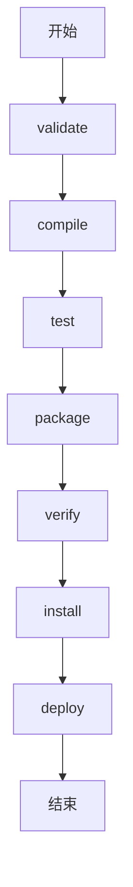
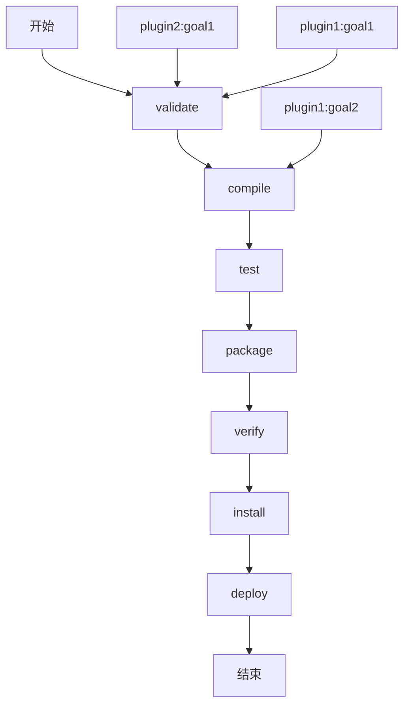
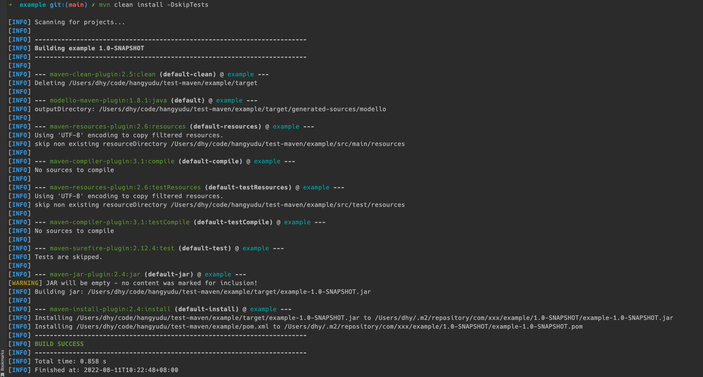

# test-maven
test-maven

## reference

- [Maven Getting Started Guide](https://maven.apache.org/guides/getting-started/index.html)
- [Maven 入门指南](https://www.jianshu.com/p/b4ef9978d85d)
- [Maven 生命周期](https://www.jianshu.com/p/fd43b3d0fdb0)
- [Maven 默认插件以及功能](https://www.jianshu.com/p/977b71e2837e)
- [maven 依赖管理](https://www.jianshu.com/p/f6ca45865025)
- [maven-shade-plugin 入门指南](https://www.jianshu.com/p/7a0e20b30401)
- [maven-assembly-plugin 入门指南](https://www.jianshu.com/p/14bcb17b99e0)
- [Lifecycle Reference](https://maven.apache.org/guides/introduction/introduction-to-the-lifecycle.html#lifecycle-reference)
- [dependencyManagement与dependencies区别](https://www.jianshu.com/p/c8666474cf9a)
- [Maven打包之maven-shade-plugin](https://cloud.tencent.com/developer/article/1622207)

## Maven Getting Started Guide

### How do I make my first Maven project?

```bash
mkdir archetype

mvn archetype:generate -DgroupId=com.xxx -DartifactId=arthetype -Dpackagename=com.xxx -DarchetypeArtifactId=maven-archetype-quickstart -DarchetypeVersion=1.4
```

### How do I xxx my project?

> the compiled classes were placed in `${basedir}/target/classes`

```bash
mvn compile
```

> You can now take a look in the `${basedir}/target` directory and you will see the generated JAR file.

````bash
mvn package
````

> Now you'll want to install the artifact you've generated (the JAR file) in your local repository (`${user.home}/.m2/repository` is the default location)

```bash
mvn install
```

### How do I add resources to my JAR?

> You see below in our example we have added the directory `${basedir}/src/main/resources` into which we place any resources we wish to package in our JAR. The simple rule employed by Maven is this: 
>
> **any directories or files placed within the `${basedir}/src/main/resources` directory are packaged in your JAR `with the exact same structure starting at the base of the JAR`.**

### How do I filter resource files?

> Sometimes a resource file will need to contain a value that can only be supplied at build time. To accomplish this in Maven, put a reference to the property that will contain the value into your resource file using the syntax `${<property name>}`. The property can be one of the values defined in your pom.xml, a value defined in the user's settings.xml, a property defined in an external properties file, or a system property.
>
> To have Maven filter resources when copying, simply set `filtering` to true for the resource directory in your `pom.xml`:

```xml
  <build>
    <resources>
      <resource>
        <directory>src/main/resources</directory>
        <filtering>true</filtering>
      </resource>
    </resources>
  </build>
```

> include file with property

```xml
        <resources>
            <resource>
                <directory>src/main/resources/${env}</directory>
                <includes>
                    <include>**</include>
                </includes>
            </resource>
        </resources>
```

### How do I build other types of projects?

```bash
mvn archetype:generate \
    -DarchetypeGroupId=org.apache.maven.archetypes \
    -DarchetypeArtifactId=maven-archetype-webapp \
    -DgroupId=com.mycompany.app \
    -DartifactId=my-webapp
```

> use `<packaging>war</packaging>`

```xml
<project xmlns="http://maven.apache.org/POM/4.0.0" xmlns:xsi="http://www.w3.org/2001/XMLSchema-instance"
  xsi:schemaLocation="http://maven.apache.org/POM/4.0.0 https://maven.apache.org/xsd/maven-4.0.0.xsd">
  <modelVersion>4.0.0</modelVersion>
 
  <groupId>com.mycompany.app</groupId>
  <artifactId>my-webapp</artifactId>
  <version>1.0-SNAPSHOT</version>
  <packaging>war</packaging>
 
  <dependencies>
    <dependency>
      <groupId>junit</groupId>
      <artifactId>junit</artifactId>
      <version>4.11</version>
      <scope>test</scope>
    </dependency>
  </dependencies>
 
  <build>
    <finalName>my-webapp</finalName>
  </build>
</project>
```

```bash
mvn package
```

### How do I build more than one project at once?

> file structure

```
+- pom.xml
+- my-app
| +- pom.xml
+- my-webapp
| +- pom.xml
```

> The POM file you'll create should contain the following:

```xml
<project xmlns="http://maven.apache.org/POM/4.0.0" xmlns:xsi="http://www.w3.org/2001/XMLSchema-instance"
  xsi:schemaLocation="http://maven.apache.org/POM/4.0.0 https://maven.apache.org/xsd/maven-4.0.0.xsd">
  <modelVersion>4.0.0</modelVersion>
 
  <groupId>com.mycompany.app</groupId>
  <artifactId>app</artifactId>
  <version>1.0-SNAPSHOT</version>
  <packaging>pom</packaging>
 
  <modules>
    <module>my-app</module>
    <module>my-webapp</module>
  </modules>
</project>
```

> We'll need a dependency on the JAR from the webapp, so add this to `my-webapp/pom.xml`:

```xml
  <dependencies>
    <dependency>
      <groupId>com.mycompany.app</groupId>
      <artifactId>my-app</artifactId>
      <version>1.0-SNAPSHOT</version>
    </dependency>
    ...
  </dependencies>
```

> Finally, add the following `<parent>` element to both of the other `pom.xml` files in the subdirectories:

```xml
<project xmlns="http://maven.apache.org/POM/4.0.0" xmlns:xsi="http://www.w3.org/2001/XMLSchema-instance"
  xsi:schemaLocation="http://maven.apache.org/POM/4.0.0 https://maven.apache.org/xsd/maven-4.0.0.xsd">
  <parent>
    <groupId>com.mycompany.app</groupId>
    <artifactId>app</artifactId>
    <version>1.0-SNAPSHOT</version>
  </parent>
  ...
```

## maven 构建生命周期（lifecycle）

> Maven 构建 `lifecycle` 就是 Maven 将一个整体任务划分为一个个的 `phase`，类似于流程图，按顺序依次执行。也可以指定该任务执行到中间的某个阶段结束。



### 3. 阶段与插件的关系

>Maven 将构建过程定义为 default lifecycle，并将 default lifecycle 划分为一个个的阶段 phase，这一系列 phase 仅仅是规定执行顺序，至于每个阶段做什么工作？由谁来做？答案就在 插件（plugins） 中。
>
>一个插件可以支持多种功能，称之为目标（goal），例如：compiler 插件有两个目标：compile 和 testCompile，分别实现编译源代码 和 编译测试代码。
>
>如何将插件与 Maven 的构建生命周期绑定在一起呢？通过将插件的目标（goal）与 build lifecycle 中 phase 绑定到一起，这样，当要执行某个 phase 时，就调用插件来完成绑定的目标。



### 4. 如何为自己的工程创建构建生命周期

#### 设置不同的 packaging 类型

>在 pom.xml 文件中，packaging 类型支持 jar, war, ear, pom 等多种类型，不同的 packaging 类型会使得不同的 phase 绑定不同的 plugin goal。下面是 packaging 类型为 jar 时，phase 与 plugin goal 的映射关系。

| Phase                    | plugin:goal               |
| :----------------------- | :------------------------ |
| `process-resources`      | `resources:resources`     |
| `compile`                | `compiler:compile`        |
| `process-test-resources` | `resources:testResources` |
| `test-compile`           | `compiler:testCompile`    |
| `test`                   | `surefire:test`           |
| `package`                | `jar:jar`                 |
| `install`                | `install:install`         |
| `deploy`                 | `deploy:deploy`           |

#### 配置 plugin

> 在 pom.xml 文件中， <build> <plugins> 元素下可以添加 <plugin>，通过指定 goal 和 phase 来进行绑定。
>
> 例如：将插件 maven-assembly-plugin 绑定到 phase `package` 阶段的 goal `single`。

```xml
            <plugin>
                <groupId>org.apache.maven.plugins</groupId>
                <artifactId>maven-assembly-plugin</artifactId>
                <version>3.3.0</version>
                <configuration>
                    <descriptorRefs>
                        <descriptorRef>jar-with-dependencies</descriptorRef>
                    </descriptorRefs>
                </configuration>
                <executions>
                    <execution>
                        <id>make-assembly</id>
                        <phase>package</phase>
                        <goals>
                            <goal>single</goal>
                        </goals>
                    </execution>
                </executions>
            </plugin>
```

#### Lifecycle Reference

[Lifecycle Reference](https://maven.apache.org/guides/introduction/introduction-to-the-lifecycle.html#lifecycle-reference)

## Maven 默认插件以及功能

| plugin                 | function                                              | life cycle phase        |
| ---------------------- | ----------------------------------------------------- | ----------------------- |
| maven-clean-plugin     | 清理上一次执行创建的目标文件                          | clean                   |
| maven-resources-plugin | 处理源资源文件和测试资源文件                          | resources,testResources |
| maven-compiler-plugin  | 编译源文件和测试源文件                                | compile,testCompile     |
| maven-surefire-plugin  | 执行测试文件                                          | test                    |
| maven-jar-plugin       | 创建 jar                                              | jar                     |
| maven-install-plugin   | 安装 jar，将创建生成的 jar 拷贝到 .m2/repository 下面 | install                 |
| maven-deploy-plugin    | 发布 jar                                              | deploy                  |

> **maven-clean-plugin:2.5:clean (default-clean) @ example ---**
>
> 表示的是插件 `maven-clean-plugin` ，版本 `2.5`，phase 为 `clean`，在 `example` moudle 下。
>
> 所以执行 `mvn clean install` 其实就是顺序执行了到 `install` 所有 phase，并且在每个 phase 都执行了绑定到该 phase 的插件。
>
> - maven-clean-plugin:2.5:clean (default-clean)
> - modello-maven-plugin:1.8.1:java (default)
> - maven-resources-plugin:2.6:resources (default-resources)
> - maven-compiler-plugin:3.1:compile (default-compile)
> - maven-resources-plugin:2.6:testResources (default-testResources)
> - maven-compiler-plugin:3.1:testCompile (default-testCompile)
> - maven-surefire-plugin:2.12.4:test (default-test)
> - maven-jar-plugin:2.4:jar (default-jar)
> - maven-install-plugin:2.4:install (default-install)



## Maven 依赖管理

### 包冲突如何产生？

>假设 A->B->C->D1, E->F->D2，D1,D2 分别为 D 的不同版本。
>
>如果 pom.xml 文件中引入了 A 和 E 之后，按照 Maven 传递依赖原则，工程内需要引入的实际 Jar 包将会有：A B C D1 和 E F D2，因此 D1,D2 将会产生包冲突。

### 如何解决包冲突

> Maven 解析 pom.xml 文件时，同一个 jar 包只会保留一个

### Maven 默认处理策略

>- 最短路径优先：Maven 面对 D1 和 D2 时，会默认选择最短路径的那个 jar 包，即 D2。E->F->D2 比 A->B->C->D1 路径短 1。
>- 最先声明优先：如果路径一样的话，举个🌰： A->B->C1, E->F->C2 ，两个依赖路径长度都是 2，那么就选择最先声明。

### 移除依赖

```xml
<dependency>
    <groupId>org.apache.hadoop</groupId>
    <artifactId>zookeeper</artifactId>
    <version>3.3.1</version>
    <exclusions>
        <exclusion>
            <groupId>jline</groupId>
            <artifactId>jline</artifactId>
        </exclusion>
    </exclusions>
</dependency>
```

### 检测包冲突工具

```bash
mvn dependency:help
mvn dependency:analyze
mvn dependency:tree
mvn dependency:tree -Dverbose
```

## dependencyManagement与dependencies区别

>为了项目的正确运行，必须让所有的 `module` 使用依赖项的统一版本，必须确保应用的各个项目的依赖项和版本一致，才能保证测试的和发布的是相同的结果。在我们项目顶层的pom文件中，我们会看到dependencyManagement元素。通过它元素来管理jar包的版本，**让子项目中引用一个依赖而不用显示的列出版本号**。
>
>Maven会沿着父子层次向上走，直到找到一个拥有dependencyManagement元素的项目，然后它就会使用在这个dependencyManagement元素中指定的版本号。**注意，这里假设是 project -> parent -> parent's parent 的路径，并且在两个 parent 中都存在 dependencyManagement，那么以找到的第一个为准。**

### 父pom

```xml
   <modules>
        <module>module1</module>
    </modules>
    <properties>
            <spring-version>3.1.1.RELEASE</spring-version>
    </properties>

    <dependencyManagement>
          <dependency>
                <groupId>org.springframework</groupId>
                <artifactId>spring-web</artifactId>
                <version>${spring-version}</version>
          </dependency>
    </dependencyManagement>
```

### 子pom

```xml
   <dependencies>
            <dependency>
                  <groupId>org.springframework</groupId>
                  <artifactId>spring-web</artifactId>
            </dependency>
    </dependencies>
```

### 二、dependencies应用场景

>相对于dependencyManagement，如果在父pom文件中中通过dependencies引入jar，将默认被所有的子模块继承。
>
>子模块如果希望有自己个性化的内容，可以在子模块中对于其中的某个属性进重新定义。

### 三、dependencyManagement与dependencies区别

>dependencyManagement里只是声明依赖，并不实现引入，因此子项目需要显式的声明需要用的依赖。如果不在子项目中声明依赖，是不会从父项目中继承下来的；只有在子项目中写了该依赖项，并且没有指定具体版本，才会从父项目中继承该项，并且version和scope都读取自父pom;另外如果子项目中指定了版本号，那么会使用子项目中指定的jar版本。
>
>dependencies即使在子模块中不写该依赖项，那么子模块仍然会从父项目中继承该依赖项（全部继承）。
>
>**例如，在我们上面的例子中，子pom只是声明了 `spring-web` 依赖，并没有声明版本。如果我们不声明这个依赖的话，子模块将不会有这个依赖。**

## maven-shade-plugin 入门指南

> maven-shade-plugin 将 goal shade:shade 绑定到 phase package 上。

```xml
 <build>
     <plugins>
         <plugin>
             <groupId>org.apache.maven.plugins</groupId>
             <artifactId>maven-shade-plugin</artifactId>
             <version>2.4.3</version>
             <configuration>
                <!-- put your configurations here -->
             </configuration>
             <executions>
                 <execution>
                     <phase>package</phase>
                     <goals>
                        <goal>shade</goal>
                     </goals>
                 </execution>
             </executions>
         </plugin>
     </plugins>
 </build>
```

> 将该工程依赖的部分 Jar 包 include/exclude 掉。

```xml
<build>
    <plugins>
      <plugin>
        <groupId>org.apache.maven.plugins</groupId>
        <artifactId>maven-shade-plugin</artifactId>
        <version>2.4.3</version>
        <executions>
          <execution>
            <phase>package</phase>
            <goals>
              <goal>shade</goal>
            </goals>
            <configuration>
              <artifactSet>
                <excludes>
                  <exclude>classworlds:classworlds</exclude>
                  <exclude>junit:junit</exclude>
                  <exclude>jmock:*</exclude>
                  <exclude>*:xml-apis</exclude>
                  <exclude>org.apache.maven:lib:tests</exclude>
                  <exclude>log4j:log4j:jar:</exclude>
                </excludes>
              </artifactSet>
            </configuration>
          </execution>
        </executions>
      </plugin>
    </plugins>
</build>
```

## Maven打包之maven-shade-plugin

### shade打包过程

> shade插件绑定在maven的package阶段，他会将项目依赖的jar包解压并融合到项目自身编译文件中。
>
> 举个例子：例如我们的项目结构是

```
com.gavinzh.learn.shade
    Main
```

> 假设我们依赖了一个jar包，他的项目结构是:

```
com.fake.test
    A
    B
```

> 那么shade会将这两个结构融合为一个结构:

```
com
    gavinzh.learn.shade
        Main
    fake.test
        A
        B
```

### shade配置

```xml
    <build>
        <plugins>
            <plugin>
                <groupId>org.apache.maven.plugins</groupId>
                <artifactId>maven-shade-plugin</artifactId>
                <version>3.1.1</version>
                <configuration>
                    <!--只包含该项目代码中用到的jar,在父项目中引入了，但在当前模块中没有用到就会被删掉-->
                    <minimizeJar>true</minimizeJar>
                    <!--重新定位类位置，就好像类是自己写的一样，修改别人jar包的package-->
                    <relocations>
                        <relocation>
                            <pattern>com.alibaba.fastjson</pattern>
                            <shadedPattern>com.gavinzh.learn.fastjson</shadedPattern>
                            <excludes>
                                <!--这些类和包不会被改变-->
                                <exclude>com.alibaba.fastjson.not.Exists</exclude>
                                <exclude>com.alibaba.fastjson.not.exists.*</exclude>
                            </excludes>
                        </relocation>
                    </relocations>
                </configuration>
                <executions>
                    <execution>
                        <configuration>
                            <!--创建一个你自己的标识符，位置在原有名称之后-->
                            <shadedArtifactAttached>true</shadedArtifactAttached>
                            <shadedClassifierName>gavinzh</shadedClassifierName>
                            <!--在打包过程中对文件做一些处理工作-->
                            <transformers>
                                <!--在META-INF/MANIFEST.MF文件中添加key: value 可以设置Main方法-->
                                <transformer
                                        implementation="org.apache.maven.plugins.shade.resource.ManifestResourceTransformer">
                                    <manifestEntries>
                                        <mainClass>com.gavinzh.learn.shade.Main</mainClass>
                                        <Build-Number>123</Build-Number>
                                        <Built-By>your name</Built-By>
                                        <X-Compile-Source-JDK>1.7</X-Compile-Source-JDK>
                                        <X-Compile-Target-JDK>1.7</X-Compile-Target-JDK>
                                    </manifestEntries>
                                </transformer>
                                <!--阻止META-INF/LICENSE和META-INF/LICENSE.txt-->
                                <transformer implementation="org.apache.maven.plugins.shade.resource.ApacheLicenseResourceTransformer"/>
                                <!--合并所有notice文件-->
                                <transformer implementation="org.apache.maven.plugins.shade.resource.ApacheNoticeResourceTransformer">
                                    <addHeader>true</addHeader>
                                </transformer>
                                <!--如果多个jar包在META-INF文件夹下含有相同的文件，那么需要将他们合并到一个文件里-->
                                <transformer implementation="org.apache.maven.plugins.shade.resource.AppendingTransformer">
                                    <resource>META-INF/spring.handlers</resource>
                                </transformer>
                                <transformer implementation="org.apache.maven.plugins.shade.resource.AppendingTransformer">
                                    <resource>META-INF/spring.schemas</resource>
                                </transformer>
                                <transformer implementation="org.apache.maven.plugins.shade.resource.AppendingTransformer">
                                    <resource>META-INF/spring.factories</resource>
                                </transformer>
                                <transformer implementation="org.apache.maven.plugins.shade.resource.AppendingTransformer">
                                    <resource>META-INF/spring.tld</resource>
                                </transformer>
                                <transformer implementation="org.apache.maven.plugins.shade.resource.AppendingTransformer">
                                    <resource>META-INF/spring-form.tld</resource>
                                </transformer>
                                <transformer implementation="org.apache.maven.plugins.shade.resource.AppendingTransformer">
                                    <resource>META-INF/spring.tooling</resource>
                                </transformer>
                                <!--如果多个jar包在META-INF文件夹下含有相同的xml文件，则需要聚合他们-->
                                <transformer implementation="org.apache.maven.plugins.shade.resource.ComponentsXmlResourceTransformer"/>
                                <!--排除掉指定资源文件-->
                                <transformer implementation="org.apache.maven.plugins.shade.resource.DontIncludeResourceTransformer">
                                    <resource>.no_need</resource>
                                </transformer>
                                <!--将项目下的文件file额外加到resource中-->
                                <transformer implementation="org.apache.maven.plugins.shade.resource.IncludeResourceTransformer">
                                    <resource>META-INF/pom_test</resource>
                                    <file>pom.xml</file>
                                </transformer>
                                <!--整合spi服务中META-INF/services/文件夹的相关配置-->
                                <transformer implementation="org.apache.maven.plugins.shade.resource.ServicesResourceTransformer"/>
                            </transformers>
                        </configuration>
                        <phase>package</phase>
                        <goals>
                            <goal>shade</goal>
                        </goals>
                    </execution>
                </executions>
            </plugin>
        </plugins>
    </build>
```

### shade 配置2

> 1. 通过 `artifactSet` 来指定 artifactId；
> 2. 

```xml
    <build>
        <plugins>
            <plugin>
                <groupId>org.apache.maven.plugins</groupId>
                <artifactId>maven-shade-plugin</artifactId>
                <configuration>
                    <createDependencyReducedPom>false</createDependencyReducedPom>
                </configuration>
                <executions>
                    <execution>
                        <phase>package</phase>
                        <goals>
                            <goal>shade</goal>
                        </goals>
                        <configuration>
                            <!-- 只保留指定的 artifactId -->
                            <artifactSet>
                                <includes>
                                    <include>com.google.guava:guava</include>
                                </includes>
                            </artifactSet>
                            <!-- 移动包名 -->
                            <relocations>
                                <relocation>
                                    <pattern>com.google</pattern>
                                    <shadedPattern>com.google.shaded</shadedPattern>
                                </relocation>
                            </relocations>
                        </configuration>
                    </execution>
                </executions>
            </plugin>
        </plugins>
    </build>
```


## maven-assembly-plugin 入门指南

### 使用方法

>使用 descriptorRefs(官方提供的定制化打包方式)，官方提供的 descriptorRef 有 
>
>- bin
>- jar-with-dependencies
>- src
>- project。【不建议使用】

> 使用 descriptors，指定打包文件 src/assembly/src.xml，在该配置文件内指定打包操作。

```xml
<project>
  <build>
    <plugins>
      <plugin>
        <artifactId>maven-assembly-plugin</artifactId>
        <version>3.0.0</version>
        <configuration>
          <descriptors>
            <descriptor>src/assembly/src.xml</descriptor>
          </descriptors>
        </configuration>
      </plugin>
    </plugins>
  </build>
</project>
```

### 描述符文件元素

> id 标识符，添加到生成文件名称的后缀符。如果指定 id 的话，目标文件则是 artifactId-`{id}`.tar.gz

```xml
<id>release</id>
```

### formats

> maven-assembly-plugin 支持的打包格式有zip、tar、tar.gz (or tgz)、tar.bz2 (or tbz2)、jar、dir、war，可以同时指定多个打包格式

```xml
  <formats>
    <format>tar.gz</format>
    <format>dir</format>
  </formats>
```

### dependencySets

| element           | type         | function                             |
| ----------------- | ------------ | ------------------------------------ |
| outputDirectory   | string       | 指定包依赖目录，该目录是相对于根目录 |
| includes/include* | List<String> | 包含依赖                             |
| excludes/exclude* | List<String> | 排除依赖                             |

```xml
<dependencySets>
    <dependencySet>
      <outputDirectory>/lib</outputDirectory>
    </dependencySet>
</dependencySets>
```


